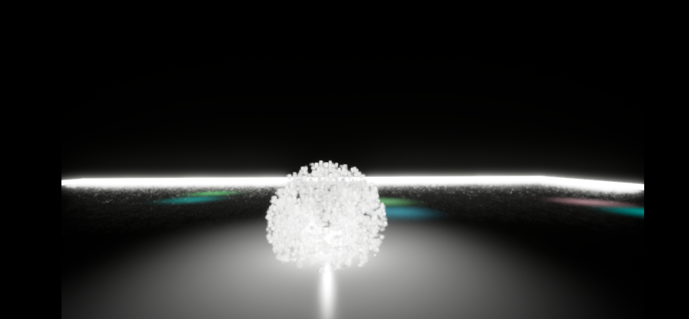
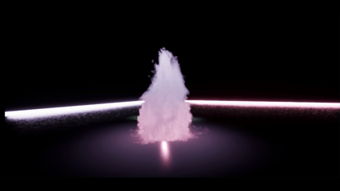
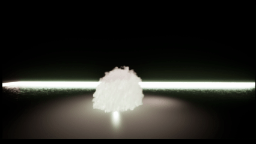
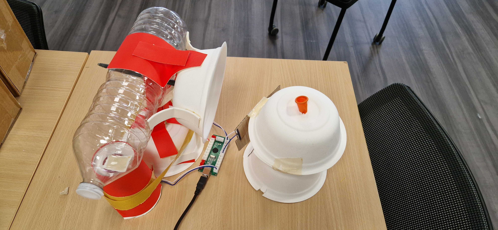
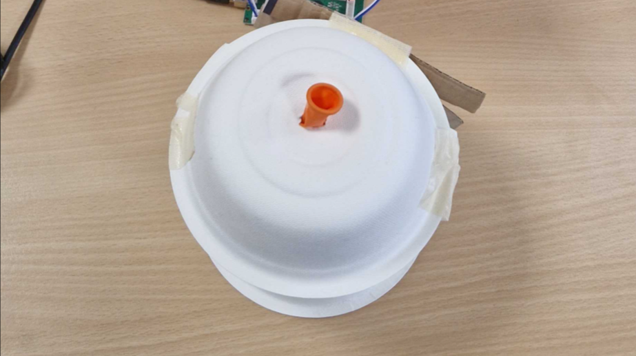
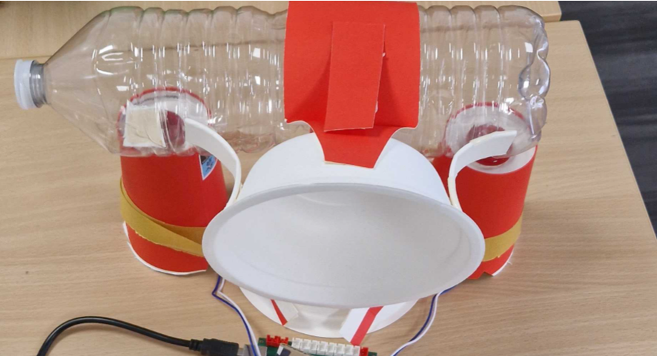
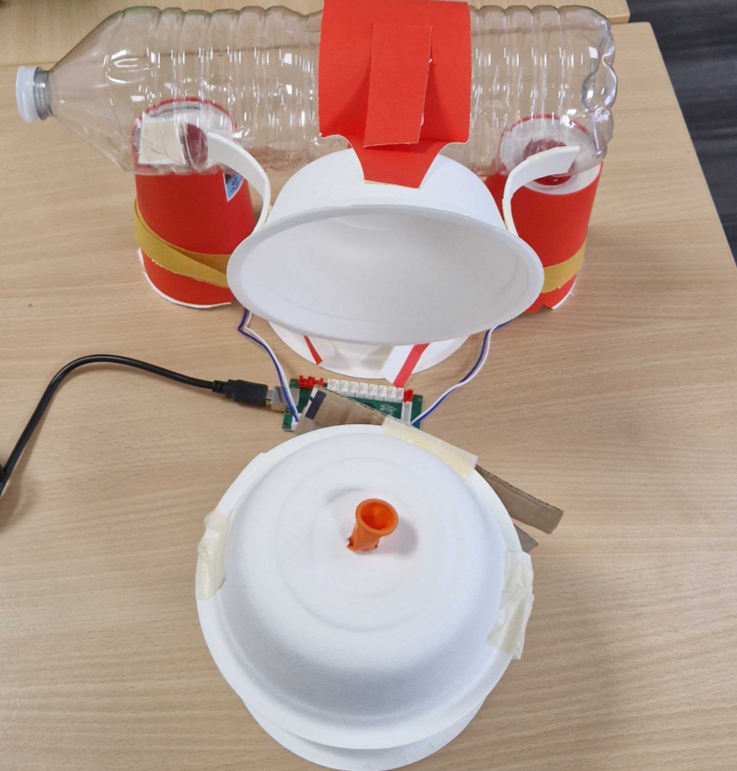

# Alternative Controller – Visual Particle Experience  
*Unreal Engine 5 – Niagara – Controller Alternatif*

---

## Description du projet

Ce projet propose une expérience visuelle mettant en avant **Niagara (UE5)**.  
Le joueur contrôle une **sphère de particules colorées** évoluant dans un environnement **entièrement noir**, uniquement structuré par des **néons lumineux** délimitant la carte.

En traversant certaines **zones de lumière**, la sphère absorbe leurs **couleurs**, créant un contraste fort au sein de l'obscurité.

On peut également **controller du vent** pour jouer avec les particules de la sphère, lorsque celle-ci change de couleur.

---

## Objectifs

- Mettre en scène les capacités visuelles de **Niagara**  
- Créer un environnement minimaliste basé sur la lumière  
- Expérimenter avec un **controller alternatif physique**

---

## Controller Alternatif

### 🔸 Déplacement — Souffle + Ballon  
Le joueur souffle dans un ballon qui, en se gonflant, presse un **bouton physique**.  
Lorsque le bouton s’active, la sphère avance.

**Logique :** interaction basée sur le **flux d’air** et la mise sous pression.

### 🔸 Rotation — Volant manuel  
Un **volant physique** permet de tourner à droite et à gauche.

---

## Gameplay

- Observer les mouvements des particules de la sphère dans un monde sombre et silencieux
- Utiliser les **néons** comme repères et limites
- Changer de couleur en traversant les zones lumineuses  
- Jouer physiquement : souffler, tourner, manipuler le controller

---

## Technologies utilisées

| Technologie | Utilisation |
|------------|-------------|
| **UE5** | Moteur du jeu |
| **Niagara** | Particules & effets visuels |
| **Microcontroller / Capteurs** | Inputs & carte mère |
| **Prototype en carton** | Structure physique actuelle |

---

## Axes d'amélioration

### 1. Capteur d’air / pression  
Remplacer le ballon par :  
- un **capteur de pression différentielle**, ou  
- un **capteur de flux d’air**.

 Objectif : **précision**, **durabilité**, **hygiène**, meilleure **réactivité**.

### 2. Structure du controller  

Le controller est actuellement en **carton**.  
Une future version pourrait inclure :

- **Structure imprimée en 3D**  
- Composants internes mieux intégrés à la structure
- Amélioration de l’ergonomie générale  

 Objectif : **solidité**, **qualité**.
